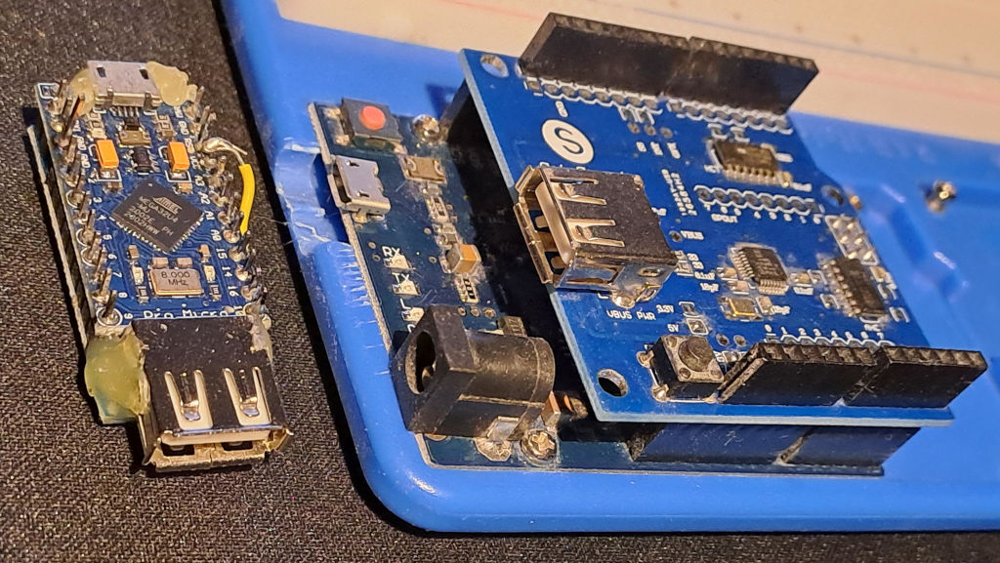
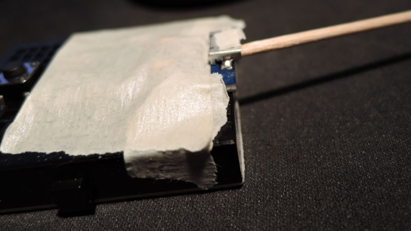
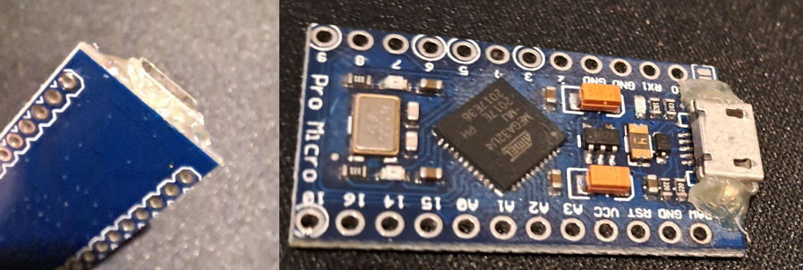
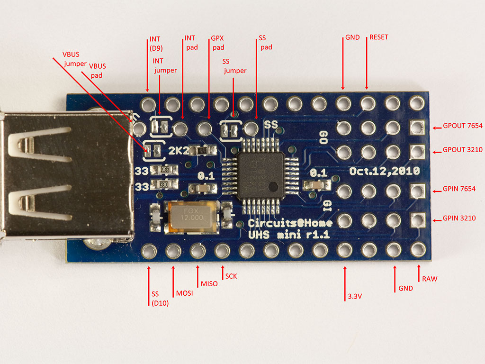
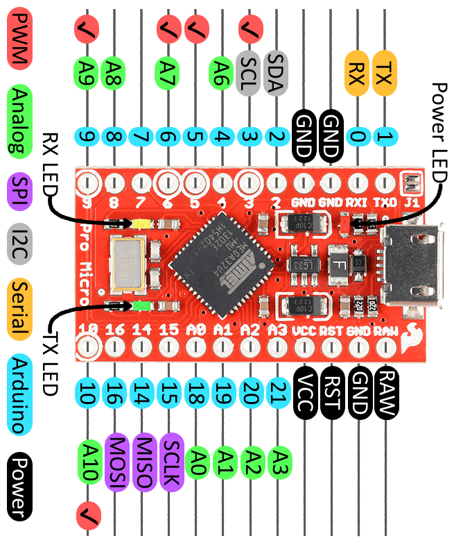
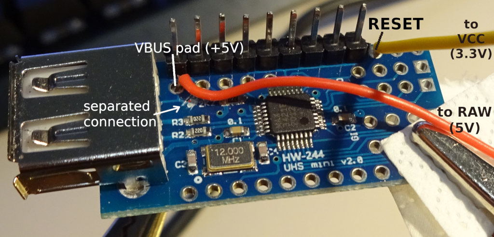
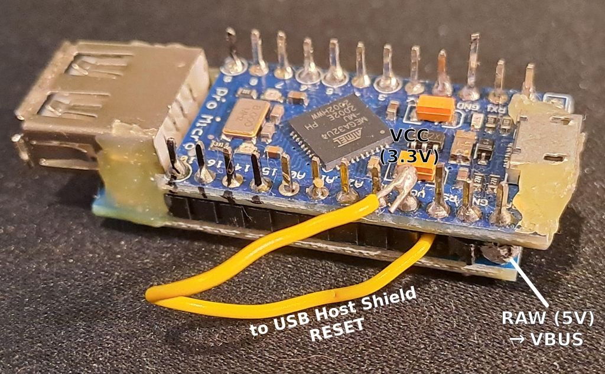
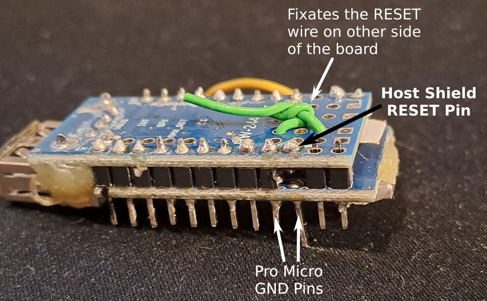

# USB-to-USB keyboard adaptor for Arduinos with USB Host Shield

This project allows creating an adapter that turns supported gaming keyboards with too many or
confusing endpoints *(for finicky hardware like KVM switches, ancient operating systems and similar
cases that lack full HID support)* into a basic USB "Boot protocol" keyboard with one additional
endpoint for "multimedia keys" (play, pause, open calculator, ...).

It can also be used to remap keys, like turning *Capslock* into *Right Ctrl* or *Mute* or whatever
you want.

## Hardware requirements

This needs an Arduino or similar that can act as an USB device (keyboard, mouse, ...), like an
[Arduino Leonardo](https://docs.arduino.cc/hardware/leonardo/) or [Sparkfun Pro Micro](https://www.sparkfun.com/pro-micro-3-3v-8mhz.html) (the **3.3V 8MHz** version!).

Furthermore it needs an [**USB Host Shield**](https://chome.nerpa.tech/arduino_usb_host_shield_projects/) - 
either the full-sized version or the *Mini* version, depending on what kind of Arduino (-like device)
you're using.

Note that the **USB Host Shield Mini** operates with **3.3V**, unlike most addon-boards in the
Arduino ecosystem that operate with 5V. This is why, if you use it with a Pro Micro, you need to
use the 3.3V version.  
See [below](#how-to-use-the-usb-host-shield-mini-with-a-pro-micro) for more information on using
the USB Host Shield Mini with a Pro Micro.

The full-sized version supports 5V and works fine with regular Leonardos and other Arduino-like
boards in that format. Using that is definitely the easier solution, as it doesn't even require
soldering.

Using cheap clones of the boards and the USB Host Shield should generally work.  
TBH I'm not sure if the original USB Host Shields can even still be bought anywhere, at least the
*Circuits@Home* and *TKJ Electronics* shops don't seem to exist anymore.


## Installation

This assumes you're using Arduino IDE 2 (I tested 2.3.8 on Linux) and that it works with your
Arduino (-like) device, and that the USB Host Shield is installed on it.

* Check out the project to your filesystem
* Open the keyboard-adaptor.ino file in the IDE
* Install the *USB Host Shield Library 2.0*:
    - Click the `Sketch` menu -> `Include Library` -> `Manage Libraries...`
    - Search "usb host shield", install "USB Host Shield Library 2.0"
* Click "Verify" (✓) to compile and, when your Arduino is connected, "Upload" (→) to upload the
  program to your Arduino
* Test it, good luck, have fun

### Disabling the CDC

Now this should generally work with compatible devices... but one major point of this project is
to make keyboards work with finicky devices.

A likely problem here is that the Arduino core software for these devices (Leonardo, Pro Micro, ...)
automatically adds the a *CDC* (USB  communications device class) device for the serial-console-via-USB
device that is normally used to communicate with the Arduino when it's plugged into a PC
(for the Serial Monitor and for uploading programs).  
This can be confusing to devices expecting a simple boot-protocol keyboard (or not supporting too
many interfaces or endpoints - the CDC alone adds two interfaces and three endpoints).

Luckily it's possible to disable the CDC device, so the Arduino will really look like a simple
Boot Protocol keyboard with *one* additional interface for the multimedia keys, that each have
one endpoint.

> _**NOTE** that this means that **uploading** programs will get a bit more complicated!_
> 
> If the CDC is disabled, you need to put the Arduino into **Bootloader mode** before flashing/uploading.
> This is done by pressing the **Reset** button (or in case of the *Pro Micro* briefly connect the *Reset*
> pin to a *Ground* pin **two times** in a row) right before uploading - or actually, ideally you
> first press the *Upload* button in the Arduino IDE and then while the IDE shows "Uploading..."
> press reset (maybe twice).  
> The Arduinos only remain in *Bootloader mode* for about 8 seconds!
>
> See also [this SparkFun Guide](https://learn.sparkfun.com/tutorials/pro-micro--fio-v3-hookup-guide/troubleshooting-and-faq#ts-reset)
> on the topic.
>
> **ALSO NOTE** THAT THIS WILL DISABLE THE SERIAL CONSOLE FOR *ALL* PROJECTS YOU BUILD!  
> (at least all with devices using the Arduino AVR core).
>
> So before building other projects you may have to re-enable the CDC..

To disable the CDC, you need to modify the Arduino core software, specifically the file
`packages/arduino/hardware/avr/1.8.7/cores/arduino/USBDesc.h` - on Linux it's in
`/home/youruser/.arduino15/packages/arduino/...`.  
It's likely that the path will change slightly in the future, esp. the `1.8.7` part, when a new
version of [*ArduinoCore-avr*](https://github.com/arduino/ArduinoCore-avr/) is released.

Anyway, in `USBDesc.h` look for the line `//#define CDC_DISABLED` and remove the comment, so it's
just `#define CDC_DISABLED`.  
Restoring CDC support is of course done similarly: Change that line back to `//#define CDC_DISABLED`.

For this change to be actually used when compiling your project, you first need to **remove the
build cache**, because the Arduino IDE (or compiler or whatever?) caches the "cores" once they
are compiled and unfortunately does not check if their source has changed.  

Apparently the motto of the Arduino IDE developers is "make simple things simple and slightly less
simple things unnecessarily inconvenient", Arduino IDE has no simple option to clear that (or to
disable caching), so you must do it manually, by removing the build cache directory.  
On Linux that directory is `$HOME/.cache/arduino/` (or `$XDG_CACHE_HOME/arduino/`), so run  
`$ rm -r /home/youruser/.cache/arduino`

On Windows the directory to delete [allegedly](https://forum.arduino.cc/t/cache-clear-option/1040106/7)
is (or was in 2022) `C:\Users\YourName\AppData\Local\Temp\arduino-core-cache\`

Afterwards build and upload your project.

Keep in mind that you need to clear the build cache each time you enable or disable the CDC (modify `USBDesc.h`)!


## Components of this project

As you can see, this consists of several source files, not just one .ino.

Most of the components can also be used independently.

### EmulatedKeyboard.hpp/cpp

`EmulatedKeyboard` is a class implementing the **keyboard emulated by the Arduino**, which gets
**connected to your PC** (or KVM switch or whatever you want to use this with).

It reports as a standard USB "Boot protocol" keyboard (which is most compatible) and additionally
has an endpoint with a HID device that uses the "HID Consumer Page (0x0C)", which defines
"multimedia keys" like *Play*, *Mute*, *Open Calculator* etc.

One important thing to keep in mind is that it uses **scancodes** that represent *physical key
positions*, independent of keyboard layout.

This is what the USB standard does and for *"normal" keys* (scancodes < 256) the codes are
identical to the "HID Usage IDs" specified on the "Keyboard/Keypad Page (0x07)" of
[hut1_21_0.pdf](https://usb.org/sites/default/files/hut1_21_0.pdf), the official
USB *HID Usage Tables* specification. In that range (< 256) they also happen to be identical to
[SDL Scancodes](https://wiki.libsdl.org/SDL3/SDL_Scancode).  
The scancodes for *Multimedia Keys* are based on the *Consumer Page (0x0C)* of the same document,
but have 256 (`KBCommon::MM_SC_OFFSET`) added to those *Usage IDs*, so they don't clash with the
"normal" keys.

This allows users of that class to treat all keys the same, `EmulatedKeyboard` will detect if the
scancode of a virtual keypress or keyrelease belongs to a normal key or multimedia key and send them
either to the emulated *USB Boot Keyboard* device or the advanced HID device for Multimedia Keys.

The `EmulatedKeyboard` class is pretty easy to use:

<details>
<summary>Click to see example code</summary>

```c++
#include "EmulatedKeyboard.hpp"

static EmulatedKeyboard emuKB;

void just_some_examples()
{
    // Note: the code in this function isn't useful as it is,
    //       it just shows how to use EmulatedKeyboard's methods

    // Press key that is 'Y' on US QWERTY keyboards (and Z on QWERTZ keyboards).
    // That key has Usage ID 0x1C according to hut1_21_0.pdf
    emuKB.Press(0x1C);

    emuKB.Release(0xE1); // release left shift key

    // Press(...) and Release(...) don't actually send any
    // events to the USB port (=> to the PC).
    //
    // That happens when calling Send(), so make sure to call it when needed!
    // (or every loop() - don't worry, Send() will just return
    //  without doing anything if no key state has changed)
    emuKB.Send();

    // Get the current state of the keyboard LEDs
    uint8_t ledState = emuKB.GetLeds();
    if(ledState & KBCommon::LED_CapsLock_Bit) {
        print("Capslock is active");
    }
    if(ledState & KBCommon::LED_NumLock_Bit) {
        print("Numlock is active");
    }
}
```

</details>

It uses (extends) the `PluggableUSBModule` class provided by Arduino, which unfortunately is not
documented on their homepage and (for the multimedia keys) uses the `HID_` class (or its `HID()`
pseudo-singleton) provided by Arduinos HID library, which is also undocumented. At least these
dependencies are always installed.

EmulatedKeyboard is partly based on code from *NikoHood's* great [HID library](https://github.com/nicohood/hid).
(It does not use that library though, so you don't have to install it)

I think this class is generally useful for all kinds of Arduino-based keyboards and keyboard-like
devices (Numpads, Macro Keypads, ...), as long as you don't need full [NKRO](https://en.wikipedia.org/wiki/Key_rollover).  
*6KRO* however is supported: 6 arbitrary "normal" keys can be pressed at once, **in addition to**
the 8 modifier keys (Left/Right Shift, Ctrl, Alt, Win) that can also be pressed all at once.  
Up to *three multimedia* keys can be pressed at once - this could be increased relatively easily,
but I don't see what that would be good for (and many gaming keyboards have the same restriction).

This component is released under the *MIT license*, like NikoHood's library.


### InputKeyboard.hpp/cpp

The `InputKeyboard` class is a keyboard driver that uses the [USB Host Shield Library 2.0](https://github.com/felis/USB_Host_Shield_2.0)
to handle the input from a physical keyboard connected to the *USB Host Shield*.

It supports the USB Boot Keyboard protocol out of the box, so the "normal" keys of almost all
keyboards should work out of the box.

Multimedia keys only work for explicitly supported keyboards, check out the `DetectDevice()`,
`ParseHIDData()` and `Handle*MultimediaKeyReport()` methods in InputKeyboard.cpp for how to add
support for additional keyboards.  
This sounds very complicated, but chances are good that your keyboard uses the same format for
multimedia keys as one of the supported keyboards and you only need to add a case in `DetectDevice()`
with the device's USB Vendor/Product ID and the endpoint and report IDs.

Yes, it's ugly and hacky that keyboards need hardcoded support, but doing this "properly" in code would
require parsing and handling arbitrary HID Report Descriptors, which would probably be pretty hard
with the 2560 Bytes(!) of SRAM and 32KB of Flash storage space available on the Leonardo or Pro Micro...

To use it you must *derive your own class* from the `InputKeyboard` class and overwrite a few
methods that will be called by the USB Host Shield Library, like `void OnKeyPress(uint16_t scancode)`
and `void OnKeyRelease(uint16_t scancode)`.  
A good (and simple) example is the `PassthroughKeyboard` class in [`keyboard-adaptor.ino`](./keyboard-adaptor.ino).

Of course `InputKeyboard` uses the same *scancodes* as `EmulatedKeyboard`.

Some constants used by both classes are in [`KeyboardCommon.hpp`](./KeyboardCommon.hpp).

This component is licensed under the *GPLv2*, like the USB Host Shield Library 2.0, because it's
based on code from that library.

*(`KeyboardCommon.hpp` is released to the public domain, so you can use it with any component without
having to add *another* license to your project.)*

### DGHelpers.hpp

Just some useful functions I wrote, mostly for printing:

* `PrintAll(...)` takes an arbitrary amount of arguments that must be supported by
  [`Serial.print()`](https://docs.arduino.cc/language-reference/en/functions/communication/serial/print/)
  and calls that function to print them all
* `PrintlnAll(...)` does the same but adds a newline
* `AsHex(n)` formats the integer `n` in hex (without "0x" prefix). It always prints all bytes of
  an int, even 0-bytes, so `(int16)1` will be printed as "0001" instead of just "01".  
  Use this with `Serial.print()` or `PrintAll()`, like `PrintAll("fourtytwo = ", AsHex(42), " var = ", AsHex(var));`
* `FindInArray(T elem, const T* arr, int len)` returns the index of the first occurrence of value
  `elem` (of type `T`) in array `arr` that has a length of `len`.  
  If that value couldn't be found, `-1` is returned.

This file is released to the public domain, do whatever you want with it.

### keyboard-adaptor.ino

This ties it all together.

It has the `setup()` and `loop()` functions required by Arduino, the `PassthroughKeyboard` class
(derived from `InputKeyboard`) is implemented here and calls the appropriate methods of `EmulatedKeyboard`
in its own methods (`OnKeyPress()`  etc) to pass on events from the connected keyboard to the
PC (or KVM or ...) that the Arduino is connected to.

So this is just relatively boring (but necessary) plumbing code.

This file is also released to the public domain.

By the way, by uncommenting the `// #define KBDWRAP_ENABLE_DEBUG` line in `KeyboardCommon.hpp`
you can enable debug messages that are printed to the Serial console (if CDC is not disabled).


## How to use the USB Host Shield Mini with a Pro Micro

Remember that you need a **3.3V** Pro Micro, because the Host Shield Mini only supports 3.3V at
its pins and might otherwise get damaged!

... or you just use a Leonardo with the full-size shield, it's much easier (but bigger):

  
*Left: Pro Micro mounted on USB Host Shield Mini, Right: Full-size USB Host Shield on Arduino Leonardo (clone).  
The Pro Micro version fits in a matchbox (not pictured).*

### Preparing the Pro Micro

The *Pro Micro* has a Micro-USB port, and if that wasn't bad enough, it's also not attached
to the board too strongly...  
I recommend using hot-melt glue to stabilize that. When I did that, I protected the parts of the board
I didn't want glue on with tape and stuck a slightly wet toothpick (with tip removed) into the port
while glueing to prevent the glue from getting into the port.



Result:  


Note: On the pictures you can see that I gave the same treatment to the Mini Host Shield's USB-A port.
That shouldn't be necessary.

Another solution might be the [SparkFun Qwiic Pro Micro](https://www.sparkfun.com/sparkfun-qwiic-pro-micro-usb-c-atmega32u4.html)
that has a USB-C port that hopefully has a better connection to the board.  
By default it uses 5V, but has "VCC" jumper pads on the back that allow running it at 3.3V (cut the connection between left "5V" and mid pad, connect the right "3V3" pad with the mid pad, see 
the "Jumpers" section in the [hookup guide](https://learn.sparkfun.com/tutorials/qwiic-pro-micro-usb-c-atmega32u4-hookup-guide/hardware-overview)).  
Note that I haven't tried the "Qwiic Pro Micro", I just think it *should* work.

There are also cheap Chinese Pro Micro ripoffs with USB-C port, but those seem to run with 5V
(based on the original Pro Micro design, not Qwiic Pro Micro) so they're not suitable for use
with the USB Host Shield Mini. Furthermore I read that their USB-C connector isn't completely
standards-conformant so USB-C-to-USB-C cables won't work.

### Connecting the Pro Micro and the USB Host Shield Mini

One thing that you should know about the cheap clones of this shield is that they're not labelled
correctly. The clones use the exact same pin layout as the original (just lacking the jumper pads),
but their labelling of the pins on the back (for MOSI, MISO and SCK) is incorrect.

For reference, here is the pin layout of the original USB Host Shield Mini, taken from the useful
[official hardware manual](https://chome.nerpa.tech/usb-host-shield-hardware-manual/):



Comparing this to the Pro Micro [pinout](https://learn.sparkfun.com/tutorials/pro-micro--fio-v3-hookup-guide/hardware-overview-pro-micro)
you'll notice that *most* of the pins are in the same position when the board is rotated correctly,
(though for some pins the host shield just has unconnected holes) so you can install the Pro Micro
on top of the host shield, connected *mostly* by rows of pin headers.



There are two little problems though:

#### The USB Host Shield Mini's `RESET` pin

It must be connected to a pin with 3.3V for it to run, but the Pro Micro pin at that position is
for *Ground*, so that definitely is not suitable.

You could probably connect it to a regular output pin of the Pro Micro and then set that to high
in software, but the easiest solution is to connect it to the Pro Micro's `VCC` pin (that provides
3.3V on 3.3V Pro Micros).

So you'll have to leave out the host shield's `RESET` pin in the header row and instead solder a
wire to the host shield's `RESET` pin, and solder the other end to the `VCC (3.3V)` pin header
connecting those pins of both boards.

#### Getting 5V out of the USB port

As the host shield operates at 3.3V, by default it will also only provide 3.3V to the USB-A-port's
*VBUS* pin - but that is supposed to provide *5V*. Some USB devices may work at 3.3V, but many won't,
so you likely want to output 5V there.

Luckily there is a solution for this problem: It's possible to connect `VBUS` directly to a 5V
source, by using the `VBUS pad` (see image above) - **however** first it must be **disconnected**
from the rest of the board, so no 5V currency flows back into the host shield (remember, more than
3.3V can break it).

The original USB Host Shield Mini has the `VBUS jumper` (see image above) just for that purpose.
The cheap clones do not have that jumper, but you can just separate the connection between `VBUS pad`
and that "2K2" resistor with a sharp knife, at the same place the original host shield has the
VBUS jumper.

Afterwards you can solder a wire into the `VBUS pad` hole, I stuck it through from above and soldered
it on the bottom, which was easy enough, see this picture (that also has the `RESET` wire already
soldered on)



The other end of the wire connected to the `VBUS pad` must be connected to the Pro Micro's `RAW`
pin which supplies 5V (from its own USB port).

#### Result

The wire from Pro Micro's `RAW` pin to `VBUS pad` is hidden between the boards, I've marked
where it's soldered to the `RAW` pin.

The wire between USB Host Shield's `RESET` pin and Pro Micro's `VCC (3.3V)` pin is longer than
needed here - whatever, I just bend it underneath the boards.

Keep in mind that you must keep the *Pro Micro's* `RST` (Reset) pin and a `GND` (Ground) pin
accessible so you can reset the Pro Micro for uploading if the CDC is disabled.

Generally I'd recommend using longer headers than the ones I'm using here so you can easily
plug a jumper cable to the pins.

  
The Pro Micro's `RST` pin is *not* connected to the Host Shields pin below it - it wouldn't matter
though, that pin is not used by the Host Shield (it's the one between `3.3V` and `GND`).  
But by leaving it out, there is a handy gap for the wire to the *Host Shield's Reset*.


  
Note that the Host Shield's `RESET` pin is *not* directly connected to the Pro Micro (with a header),
but only to a wire that is not really visible here (only its solder bump). The Pro Micro's pin at that position is one of the `GND` pins, next to `RX`.
